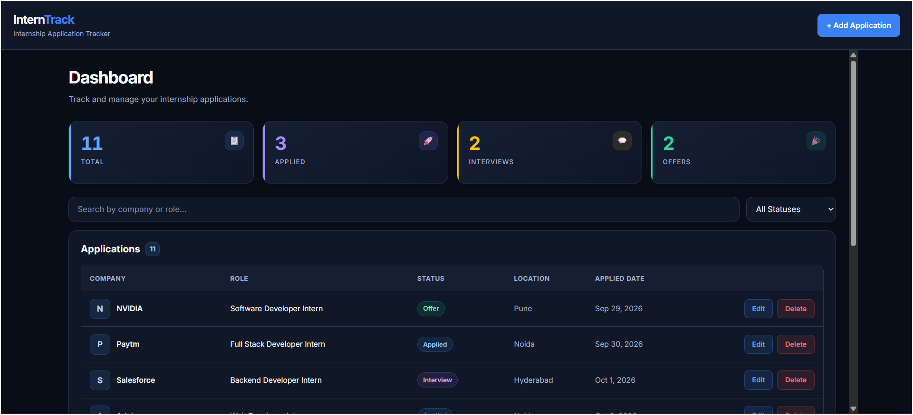
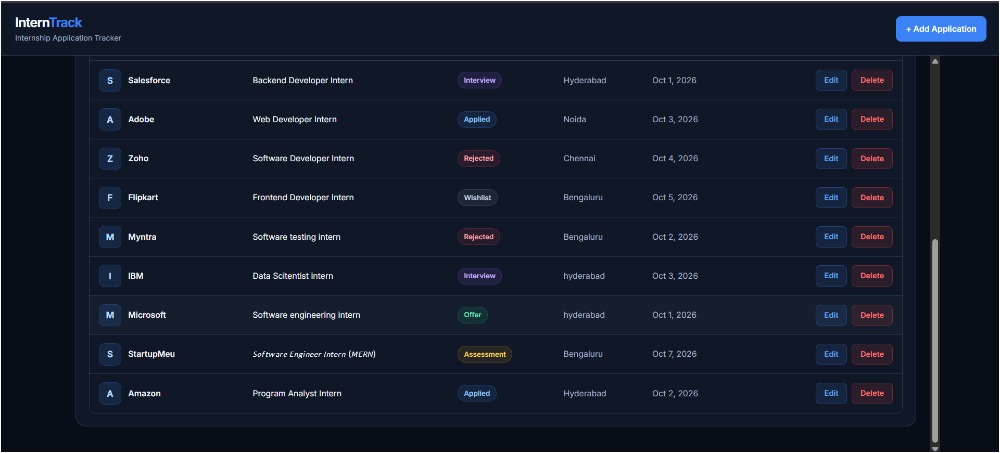
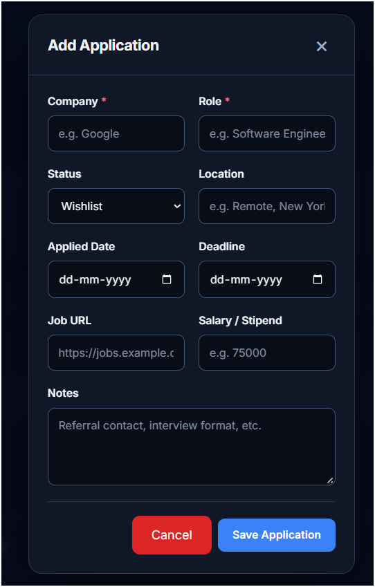
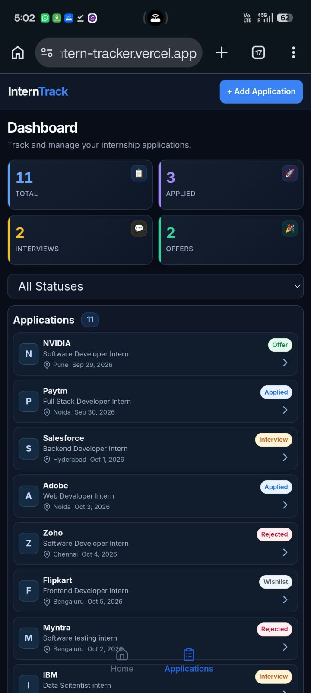

# InternTrack

A full-stack internship application tracker built with the MERN stack (MongoDB, Express, React, Node.js). Keep every opportunity in one place and follow it from wishlist to offer: add applications, update their status, search and filter them, and see live stats on a dashboard.

Built for the StartupMeu Software Engineer Intern (MERN) technical task. **AI development tool used: Kiro.**

**Live demo:** https://startupmeu-intern-tracker.vercel.app/
**API health check:** https://startupmeu-intern-tracker.onrender.com/api/health

> The backend runs on a free Render instance, so the first request after a period of inactivity can take up to a minute while it wakes up. If the dashboard shows a "server may be waking up" message, wait a moment and retry.

## Dashboard Preview

|                                      Dashboard 1                                     |                                      Dashboard 2                                     |
| :----------------------------------------------------------------------------------: | :----------------------------------------------------------------------------------: |
|  |  |

## Form & Mobile Preview

|                               Add / Edit Form                               |                                      Mobile View                                      |
| :-------------------------------------------------------------------------: | :-----------------------------------------------------------------------------------: |
|  |  |

## Features

- Create, read, update and delete internship applications
- Seven-stage status workflow: Wishlist, Applied, Assessment, Interview, Offer, Rejected, Withdrawn
- Dashboard cards with live totals (Total, Applied, Interviews, Offers)
- Search by company or role, filter by status, or combine both
- Debounced search (400 ms) that ignores out-of-order responses
- Add/edit modal with client-side validation; server-side validation messages are shown inside the form
- Loading, empty and error states, including a friendly message when the free-tier backend is waking up
- Responsive layout for desktop and mobile, with a bottom navigation bar on small screens
- Consistent REST API response format with centralized error handling

## Tech Stack

| Layer      | Technology                                                 |
| ---------- | ---------------------------------------------------------- |
| Frontend   | React 18, Vite, plain CSS, Fetch API, lucide-react icons   |
| Backend    | Node.js, Express                                           |
| Database   | MongoDB with Mongoose                                      |
| Deployment | Vercel (client), Render (server), MongoDB Atlas (database) |
| AI tool    | Kiro                                                       |

## Project Structure

```text
startupmeu-intern-tracker/
├── client/
│   └── src/
│       ├── components/     Header, Dashboard, StatsCards, ApplicationFilters,
│       │                   ApplicationList, ApplicationForm, BottomNavigation
│       │                   (each with its own CSS file)
│       ├── hooks/          useApplications.js (data, filters, delete),
│       │                   useApplicationForm.js (add/edit form state)
│       ├── services/       applicationService.js (all API calls)
│       ├── App.jsx         composes Header, Dashboard and the form
│       └── App.css, index.css
└── server/
    ├── config/             db.js (MongoDB connection)
    ├── controllers/        applicationController.js
    ├── middleware/         errorHandler.js
    ├── models/             Application.js (Mongoose schema)
    ├── routes/             applicationRoutes.js
    ├── utils/              apiResponse.js, escapeRegex.js
    ├── .env.example
    └── server.js
```

## Getting Started

### Prerequisites

- Node.js 18 or newer and npm
- A MongoDB database: either a local instance or a free [MongoDB Atlas](https://www.mongodb.com/atlas) cluster

### 1. Clone

```bash
git clone https://github.com/karthikyannabathina/startupmeu-intern-tracker.git
cd startupmeu-intern-tracker
```

### 2. Run the backend

```bash
cd server
npm install
cp .env.example .env      # on Windows: copy .env.example .env
```

Edit `server/.env`:

```env
PORT=5000
MONGO_URI=mongodb://localhost:27017/interntrack
NODE_ENV=development
```

**Using MongoDB Atlas instead of a local database?** In Atlas, choose *Connect → Drivers* and copy the standard (non-SRV) connection string, which starts with `mongodb://` rather than `mongodb+srv://`. It looks like this (replace every `<...>` placeholder with your own values, and never commit real credentials):

```env
MONGO_URI=mongodb://<username>:<password>@<shard-00-00-host>:27017,<shard-00-01-host>:27017,<shard-00-02-host>:27017/interntrack?ssl=true&replicaSet=<replica-set-name>&authSource=admin&retryWrites=true&w=majority
```

Also add your IP address under *Network Access* in Atlas, and URL-encode special characters in the password (for example `@` becomes `%40`).

Start it:

```bash
npm run dev     # with nodemon (auto-restart)
# or
npm start
```

The API is now at `http://localhost:5000`.

### 3. Run the frontend

In a second terminal:

```bash
cd client
npm install
npm run dev
```

Open `http://localhost:3000`. In development, Vite proxies `/api` requests to the Express server, so no extra configuration is needed.

### Environment variables

| Variable       | Where               | Purpose                                                                        |
| -------------- | ------------------- | ------------------------------------------------------------------------------ |
| `PORT`         | server              | Port for the API (default 5000)                                                |
| `MONGO_URI`    | server              | MongoDB connection string                                                      |
| `NODE_ENV`     | server              | `development` or `production`                                                 |
| `CLIENT_URL`   | server (production) | Extra allowed CORS origins, comma-separated (optional)                         |
| `VITE_API_URL` | client (production) | Base URL of the deployed API, no trailing slash                                |

### Production build

```bash
cd client
npm run build
```

## API Reference

Base path: `/api`

| Method | Endpoint                   | Description                                             |
| ------ | -------------------------- | ------------------------------------------------------- |
| GET    | `/applications`            | List applications (`?search=` and `?status=` supported) |
| GET    | `/applications/stats`      | Total and per-status counts                             |
| GET    | `/applications/:id`        | Get one application                                     |
| POST   | `/applications`            | Create an application                                   |
| PUT    | `/applications/:id`        | Update an application                                   |
| PATCH  | `/applications/:id/status` | Update only the status                                  |
| DELETE | `/applications/:id`        | Delete an application                                   |
| GET    | `/health`                  | Health check                                            |

Search is a case-insensitive partial match on company and role. Both filters can be combined:

```text
GET /api/applications?search=developer&status=Applied
```

### Response format

Every endpoint returns the same envelope.

```json
{ "success": true, "message": "Applications retrieved successfully", "data": [], "errors": null }
```

```json
{
  "success": false,
  "message": "Validation failed",
  "data": null,
  "errors": [{ "field": "company", "message": "Company name is required" }]
}
```

### Data model

| Field         | Type   | Rules                                         |
| ------------- | ------ | --------------------------------------------- |
| `company`     | String | Required, max 100 characters                  |
| `role`        | String | Required, max 100 characters                  |
| `status`      | String | One of the seven statuses, default `Wishlist` |
| `appliedDate` | Date   | Optional, no default                          |
| `deadline`    | Date   | Optional                                      |
| `jobUrl`      | String | Optional, must be a valid `http(s)` URL       |
| `location`    | String | Optional, max 100 characters                  |
| `salary`      | Number | Optional, not negative                        |
| `notes`       | String | Optional, max 2000 characters                 |

Timestamps (`createdAt`, `updatedAt`) are added automatically.

Example document:

```json
{
  "company": "Acme Corp",
  "role": "Software Engineer Intern",
  "status": "Applied",
  "appliedDate": "2026-10-07T00:00:00.000Z",
  "deadline": null,
  "jobUrl": "https://acme.example/jobs/123",
  "location": "Bengaluru",
  "salary": null,
  "notes": null
}
```

## Design Decisions

- **No Axios, Context or Router.** The app is a single screen, so native `fetch` (wrapped in one `request` helper) and hook-based state are enough and keep dependencies small.
- **Hooks own the logic, components stay presentational.** `useApplications` handles data, filters and delete; `useApplicationForm` handles add/edit state. All network code lives in `applicationService.js`.
- **`/stats` is registered before `/:id`** so Express never treats the word "stats" as an application id.
- **Update accepts only known fields.** `pickFields` whitelists the allowed fields, so a client cannot overwrite `_id`, timestamps or send Mongo operators.
- **Cleared fields are sent as `null` on edit** (and omitted on create), so removing a value in the form really removes it from MongoDB.
- **User search input is escaped** before it reaches `new RegExp()`, so characters like `(` or `c++` are matched literally.
- **Production errors are generic.** Every 5xx error is logged on the server, but in production the client only sees "Internal Server Error".

---

## Tool Used: Kiro

I used **Kiro** as my AI development tool, working through its chat with one focused prompt per feature. My workflow for every step was:

1. Ask Kiro to propose or explain its plan first (architecture, or "which files will you modify and why").
2. Give tightly scoped instructions: implement only one operation or feature, reuse existing helpers and components, add no dependencies, and leave unrelated code unchanged.
3. Review the diff, run the app and test the feature myself, then commit and push a checkpoint before starting the next prompt.

Partway through the project my Kiro credits ran out, so the final bug fixes and review pass (task 5 below) were done manually. I have tried to be precise about what the AI did and what I did myself.

## AI Development Experience

**In short:** I used Kiro for the architecture plan, the REST API (one endpoint per prompt), the dashboard, the add/edit/delete flows and UI polish. For every change I reviewed the diff, tested it myself and fixed what the AI got wrong. Five specific tasks are described below.

### 1. Architecture planning before any code

- **What I asked Kiro:** To analyse the requirements and propose the architecture, folder structure, data model, REST endpoints, components, validation rules and build phases, without creating or modifying any file.
- **What I changed:** I did not accept the proposal as it was. I removed contacts and timeline from the data model, fixed the status list to seven values, removed authentication, pagination and charts from the MVP, and corrected the schema to use `{ timestamps: true }` instead of separate `createdAt`/`updatedAt` fields.
- **Where the final app differs:** Kiro proposed Axios, React Context and React Router. I used the native Fetch API and component state instead, because that was enough for this scope and avoided extra dependencies.

### 2. Backend API, one operation at a time

- **What I asked Kiro:** To build the backend in phases: project foundation (config, model, error handler, response helpers), then read (list and by id), create, update, status update, delete and statistics. Each prompt covered exactly one operation, listed the validation and status codes I wanted, and said what not to touch.
- **What I checked:** Each endpoint was tested before the next phase. In the statistics prompt I required that `/stats` be registered before `/:id`, and that statuses with no applications return `0`.
- **Outcome:** A controller/route/model/middleware structure with a consistent `{ success, message, data, errors }` response format.

### 3. Frontend built incrementally

- **What I asked Kiro:** The Vite + React foundation, then a dashboard shell with placeholder values and no fake data, then API integration, then Add, Edit and Delete as separate prompts. For the integration and Add features I asked it to list the files it would change, and why, before writing code.
- **Constraints I set:** Native `fetch` only, no new dependencies, all network code in `applicationService.js`, and data and form state kept in one place (later refactored into the `useApplications` and `useApplicationForm` hooks, with a separate `Dashboard` component). For Edit, I required that the existing `ApplicationForm` be reused for both modes, that entered data stay in the form when an update fails, and that search and status filters are preserved after an update.

### 4. UI review first, then controlled polish

- **What I asked Kiro:** A review-only pass first (problems found, recommended changes, files affected, what must not change), then implementation of only the changes I approved, and finally a visual refinement towards a clean SaaS-style dashboard.
- **Guardrails I added:** Because the Edit form already worked, my prompts listed the logic that must not be overwritten (`initialData`, `isEditing`, `buildInitialFields`, `toDateInputValue`) and the modal scroll fix (`.modal` with `overflow: hidden`, `.app-form` with `overflow-y: auto; min-height: 0`).
- **Outcome:** Status badges, a cleaner list layout, better empty/loading/error states, Escape-to-close for the modal and a responsive layout, with no change to behaviour.

### 5. Debugging and hardening after review (done manually)

After the features were complete I reviewed the code myself and fixed several bugs without Kiro, because my credits had run out. I traced each one to its cause, fixed it in a separate commit and tested the exact failing input.

**First pass:**

- **Search crash:** user input went straight into `new RegExp()`, so `(` or `c++` returned a 500. An earlier commit had added the `escapeRegex` helper and its import but never called it, so the bug was still there. I caught this by re-reading the diff and re-testing with `(`, then applied the helper at the call site.
- **Fields could not be cleared on edit:** the form removed empty fields from the PUT payload, so old values stayed in MongoDB. Edits now send `null` for cleared fields. I confirmed this in the browser's Network tab.
- **Hidden validation messages and strict URL check:** the client showed only "Validation failed", and the URL regex rejected real links containing `#`, `+` or `~`. I added a shared request helper that surfaces field errors, and switched to the built-in `URL` constructor on both client and server.
- **Wishlist items showed a fake "applied" date** because `appliedDate` defaulted to today. It now has no default.

**Final review pass** (I also used Claude as a second reviewer for this pass, and tested every change with `curl` and in the browser before committing):

- **Update accepted any field from the request body:** the controller only stripped `_id` and timestamps. It now whitelists allowed fields with `pickFields`. While applying this I broke the PUT endpoint (a leftover `updateData` variable) and found it with a `curl` test, then fixed it.
- **Stats used two queries while the comment said one:** it now uses a single aggregation and derives the total from it.
- **Errors were logged only in development, and 500 messages exposed internals:** all 5xx errors are now logged, and production returns a generic message. I also removed a duplicate-key branch that the schema could never trigger.
- **Search sent a request on every keystroke, and a slow response could overwrite a newer one:** I added a 400 ms debounce and a request-id guard. I also found I had left the old effect in place, which made the first load fire two requests, and removed it.
- **Cleanup:** removed unused dependencies and the unused router wrapper, made CORS read `CLIENT_URL`, and made the 404 use the standard response format.

**What I learned:** AI-generated changes can look finished while being only partly applied. Small, scoped prompts made each change easy to review, and reading every diff and testing the real failing input caught what the AI summary did not. The same applied to my own edits: I only found my mistakes by running the tests.

## Bugs Found and Fixed

| Bug                                                        | Fix                                                    | Commit    |
| ---------------------------------------------------------- | ------------------------------------------------------ | --------- |
| Search with `(` or `c++` crashed with a 500                | Escape user input before building the RegExp           | `c41993d` |
| Optional fields could not be cleared on edit               | Send `null` on edit, omit on create                    | `03cd3be` |
| Field-level validation errors were hidden                  | Shared request helper surfaces `errors[]`              | `18aca25` |
| Valid job URLs rejected; client and server rules differed  | `URL` constructor on both sides, auto-add `https://`   | `93f2703` |
| Wishlist items showed today as the applied date            | `appliedDate` has no default                           | `93f2703` |
| Update endpoint accepted arbitrary body fields             | Whitelist allowed fields with `pickFields`             | see `git log` (`refactor: whitelist update fields`) |
| Search fired on every keystroke; stale responses could win | 400 ms debounce and a request-id guard                 | see `git log` (`perf: debounce search`) |
| Raw "Failed to fetch" when the free-tier server was asleep | Friendly "server may be waking up" message             | see `git log` (`fix: show friendly message`) |

## Known Limitations and Future Work

- No authentication yet: all data is shared, so this is a single-user tracker. JWT login with per-user data is the next step (React Router would be added at that point).
- No pagination or sorting on the list.
- Status can only be changed through the edit form; the `PATCH /status` endpoint is ready for an inline status dropdown.
- Deadlines and job links are stored but not yet shown in the list.
- The status list is defined in two client files; moving it to a shared constant is planned.
- No automated tests yet (Jest and Supertest for the API are planned). The API was tested manually with `curl` and the UI in the browser.

## Author

Karthik Yannabathina
[GitHub](https://github.com/karthikyannabathina) · karthikyannabathina4444@gmail.com
